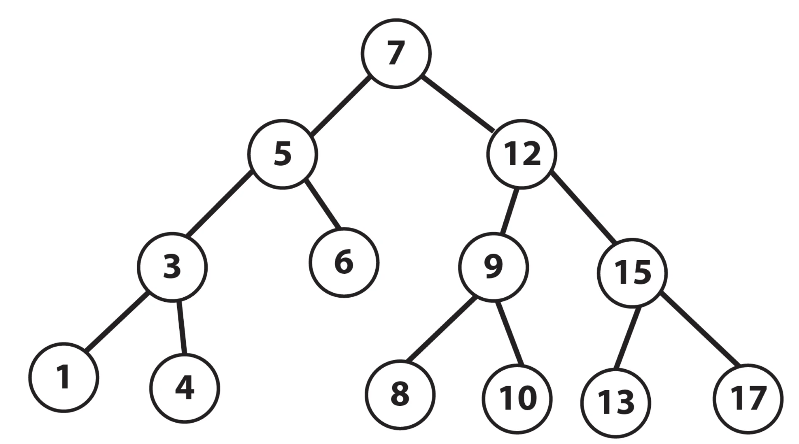

# Binary Search and Binary Search Trees - Notes

Binary search and binary search trees are pretty closely related so this section will involve both
of them.

## Binary Search Basics

The binary search is one of the fastest searching algorithms, albeit it only works if your data
is sorted already. But since the data is sorted you can do the following to quickly search in
`O(log(n))` time.

1. Find the middle of the array.
2. If the value you're looking for is less than the middle value, search the left side. Else search
the right side.
3. Repeat until you find what you're looking for.

Since you're dividing the array in half in each iteration of the search it ends up being very quick
regardless of how big the input is.

## Binary Search Tree Basics

Before jumping into BSTs let's look a the simpler *binary tree*. A binary tree is a tree data structure
with a few properties:

* We specify a root node to be the top of the tree.
* Every subsequent node must have exactly one parent node.
* Each node can only have 0, 1, or 2 leaf nodes.
* There is only one path between any two nodes.

Now this is pretty great and all but by adding a few more properties involving ordering we can have
a data structure that is very fast for searching. This is the **binary search tree**.

* For every node N in the tree:
  * Each node in the left subtree is less than N.
  * Each node in the right subtree is greater than N.

## BST Problems

